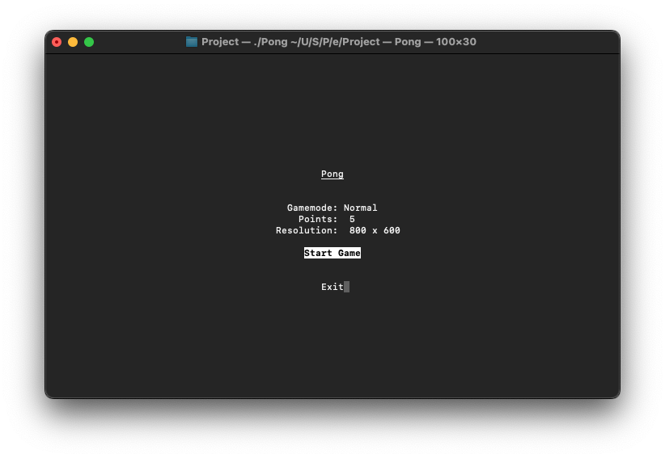
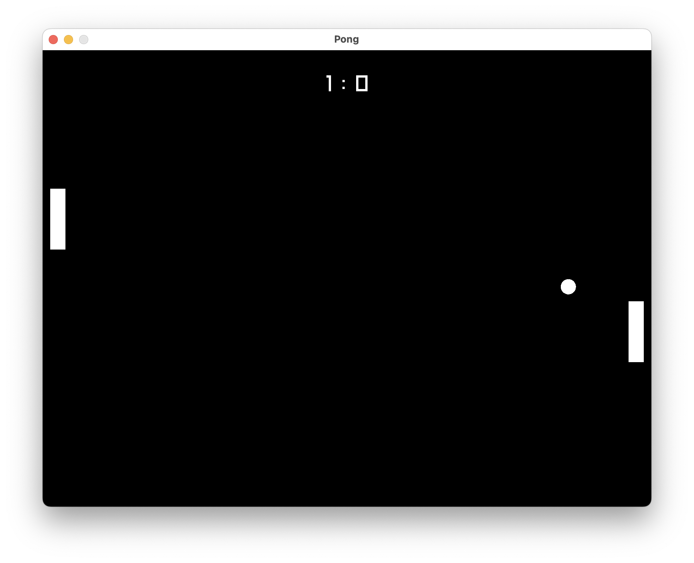

# PONG
The original pong video game written in C using [raylib](https://github.com/raysan5/raylib) for graphics.

## Building
Prerequisites:  
    - cmake  
    - make  
    - gcc / clang  
    - ncurses  
    - [raylib](https://github.com/raysan5/raylib)
```bash
$ cmake .
$ make
```

## Running
```bash
$ ./Pong
```

#### Controls
Menu:  
Navigate with the arrow keys `up`/`down`.  
Change options with arrow keys `left`/`right`.  
Enter with `space`.

Game:  
Control left paddle `W`/`S`.  
In PVP control right paddle `up`/`down`.


